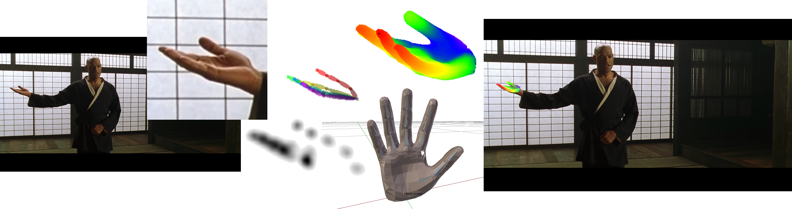

# Monocular RGB, real time 3D hand pose estimation in the wild

This repository contains scripts for testing the work:
"Using a single RGB frame for real time 3D hand pose estimation in the wild"

You can download the full paper from [here](http://users.ics.forth.gr/~argyros/mypapers/2018_03_WACV_rgbmonohand.pdf)


[](http://www.youtube.com/watch?v=VoWAmtga9fg "WACV18")

## Overview

Our method the enables the real-time estimation of the full 3D pose of one or more human hands using a single commodity RGB camera. Recent work in the area has displayed impressive progress using RGBD input. However, since the introduction of RGBD sensors, there has been little progress for the case of monocular color input. 

We capitalize on the latest advancements of deep learning, combining them with the power of generative hand pose estimation techniques to achieve real-time monocular 3D hand pose estimation in unrestricted scenarios. More specifically, given an RGB image and the relevant camera calibration information, we employ a state-of-the-art detector to localize hands.

Subsequently we run a pretrained network that estimates the 2D location of hand joints (i.e by [Gouidis et al](http://users.ics.forth.gr/~argyros/mypapers/2019_05_MVA_hand2Dkeypoints.pdf) or by [Simon et al](https://arxiv.org/abs/1704.07809)). On the final step, non-linear least-squares minimization fits a 3D model of the hand to the estimated 2D joint positions, recovering the 3D hand pose. 


## Requirements

This work depends on a set (currently) closed source of C++ libraries developed at [CVRL-FORTH](http://www.ics.forth.gr/cvrl). We provide **Ubuntu 16.04 binaries** for these libraries. Follow the instructions [here](lib/README.md) to download them and set your environment properly.

You will need **Python 3.x** to run the scripts.
The following python libraries are required:

```bash
sudo pip3 install numpy opencv-python
```

If you use the provided pretrained network for 2D Joint estimation (by Goudis et al) you will also need to istall **tensorflow**.

```bash
pip3 install tensorflow-gpu
```
NOTE: The script was tested with tensorflow 1.12.0 and CUDA 9.0

If you use the 2D joint estimator of Simon et al you will need to install [Openpose](https://github.com/CMU-Perceptual-Computing-Lab/openpose) and [PyOpenPose](https://github.com/FORTH-ModelBasedTracker/PyOpenPose). Follow the installation instructions on these projects.

## Hand detector

On our paper we use a retrained YOLO detector to detect hands (left, right) and heads in the input image.
The codebase in this project does not include that part of the pipeline. 
The example scripts use an initial bounding box and tracking to crop the user's hand in the images and pass it to the 2D joint estimator.

## Usage

You can use the 3D hand pose estimation with any 2D joint estimator. We provide two different example scripts:

### handpose.py

The **handpose.py** script uses the 2D hand joint estimator of [Gouidis et al](http://users.ics.forth.gr/~argyros/mypapers/2019_05_MVA_hand2Dkeypoints.pdf).

### handpose_simon_backend.py

This script uses the 2D hand joint estimator by Simon et al. You will need to properly install Openpose and PyOpenPose before running this script.
